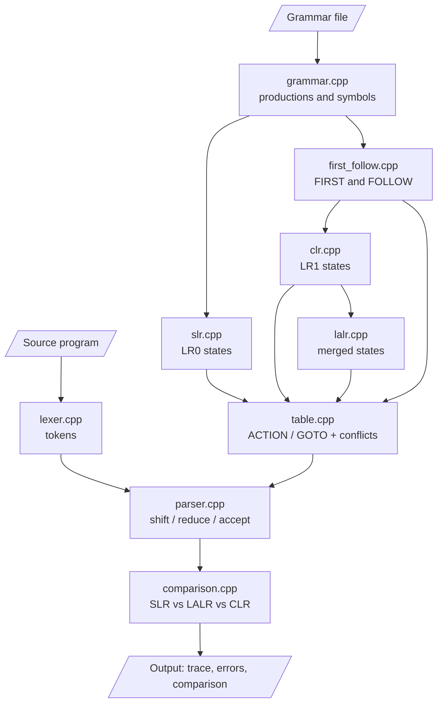

# LALR and CLR Parser for a Simple Language

SLR, CLR and LALR parsers built from scratch in C++17 for a language with
arithmetic expressions, assignments and if-else statements, compared on
the same grammar and input.

## Source Files

| File | What it does |
|------|--------------|
| `src/lexer.cpp` | Turns source code into tokens with line and column numbers and reports unknown characters. |
| `src/grammar.cpp` | Loads the grammar file, finds terminals and non-terminals, gives every symbol an id and adds `P' -> P`. |
| `src/first_follow.cpp` | Computes nullable non-terminals, then the FIRST and FOLLOW sets. |
| `src/slr.cpp` | Builds the LR(0) item sets (closure and goto) used by the SLR parser. |
| `src/clr.cpp` | Builds the LR(1) item sets with exact lookaheads used by the CLR parser. |
| `src/lalr.cpp` | Merges CLR states with the same core into LALR states. |
| `src/table.cpp` | Fills the ACTION and GOTO tables, and records and resolves conflicts. |
| `src/parser.cpp` | One table-driven parser for all three tables, with the parse trace and syntax error report. |
| `src/comparison.cpp` | Times the table builds and compares SLR, LALR and CLR on the same input. |
| `src/main.cpp` | Small fixed demo of the parsers on two sample programs. |
| `parserx.cpp` | Main program: runs every step above in order on a given grammar and program. |

## Flow



`parserx.cpp` drives this whole flow.

## How to Run

1. Install `g++` (C++17). On Windows use MSYS2 UCRT64.
2. Build from the project folder:
   ```
   make
   ```
   On Windows with MSYS2, run `mingw32-make`. Without make:
   ```
   g++ -std=c++17 -O2 -Isrc parserx.cpp src/grammar.cpp src/lexer.cpp src/first_follow.cpp src/slr.cpp src/clr.cpp src/lalr.cpp src/table.cpp src/parser.cpp src/comparison.cpp -o parserx -static
   ```
3. Run the parser on a program:
   ```
   parserx --code "y = a + b * c ;"
   parserx --input program.txt
   parserx                      (type the program, then Ctrl+Z Enter on Windows or Ctrl+D on Linux)
   ```
4. Optional flags:
   - `--grammar FILE` uses another grammar (default `grammar/language.txt`)
   - `--parser slr|lalr|clr|all` picks the parser whose trace is shown
   - `--trace brief|full|none` sets how much of the parse trace is printed
   - `--states` prints the item sets and `--tables` prints the ACTION and GOTO tables
5. Run all test cases on the three parsers:
   ```
   make test
   ```
   Results are saved in `tests/output/`.
